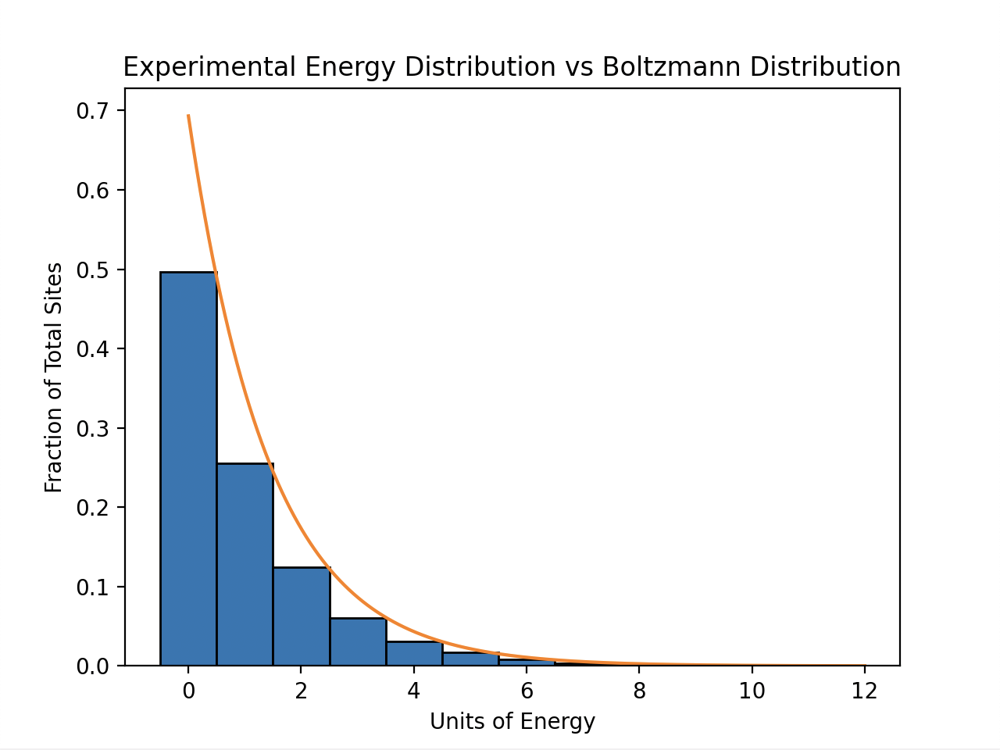

# Boltzmann Distribution

## Overview

This is a program adapted from an example in Blundell and Blundell's 'Concepts from Thermal Physics' that illustrates the statistical nature of the Boltzmann distribution. To describe what this program does, first imagine we started had n sites (where n is large), each with initial energy levels of 1. Then, after each iteration, take one unit of energy from a random site and transfer it to another. If this is performed a large number of times, it turns out that the distribution of energy levels roughly approaches a Boltzmann distribution given by ln(2)exp(-E*ln(2)) where E are the energy levels.

## Details

This program works by first creating a 1D array of ones and using a for loop to transfer the quanta of energy between each site. Since we cannot remove energy from a site with energy level 0, I have added a conditional statement to check whether the energy level at the randomly chosen site is not 0. Finally, the theoretical distribution is plotted with a histogram of the final energy distribution.

An example result with n = 10000 and 1000000 iterations is shown below:

