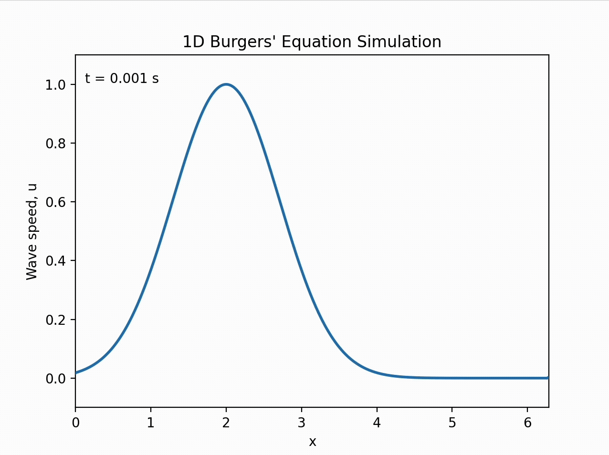

# Burgers' Equation Simulation

## Overview
`burgers.py` simulates a solution to the one dimensional Burgers' equation, a convection-diffusion PDE that characterizes the wave speed, u, of a fluid with certain viscosity. To compute a numerical solution for this equation, we use the Fourier transform to convert the PDE into an ODE and solve the ODE as we usually would. Details and a sample run of the program are given below.

## Details
As explained above, `burgers.py` makes use of the Fourier transform to convert the PDE into an ODE which we know how to solve. This is done by using the property that the Fourier transform of a derivative is proportional to the Fourier transform of the original function, allowing us to calculate the derivative using the Fourier transform instead of standard finite difference methods. This means that if we calculate the spatial derivatives as such in the Fourier transform basis and then inverse transform back, we can create an approximation for the RHS of the Burgers' equation. This is exactly what the burgers function does in the code. This function can then be inputted into scipy's odeint function to compute a solution which can be plotted as an animation.

A sample run of the program is shown below:

