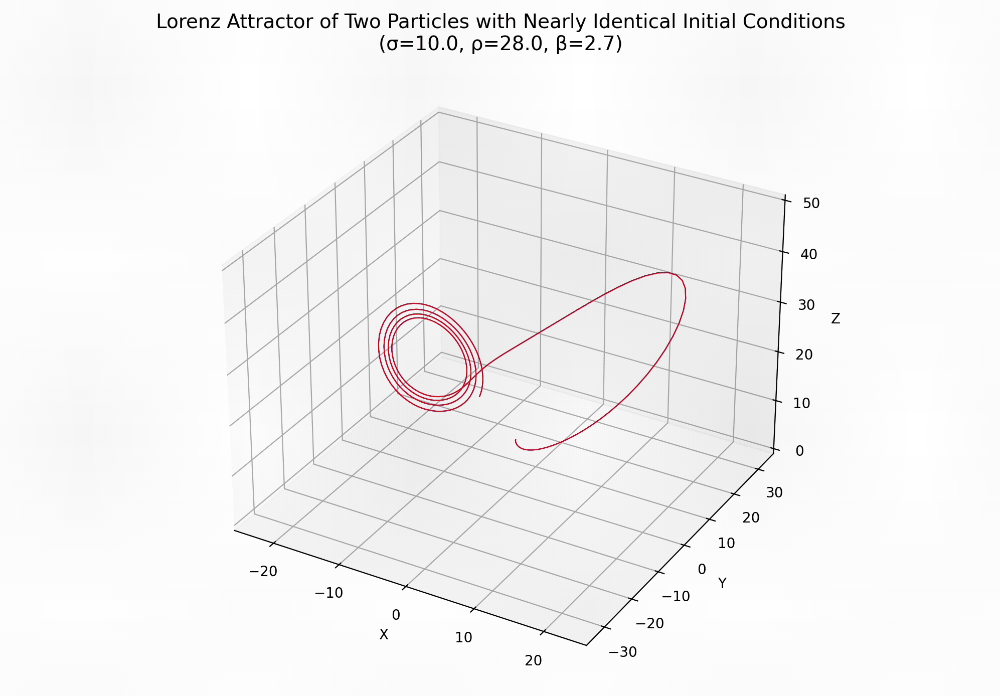
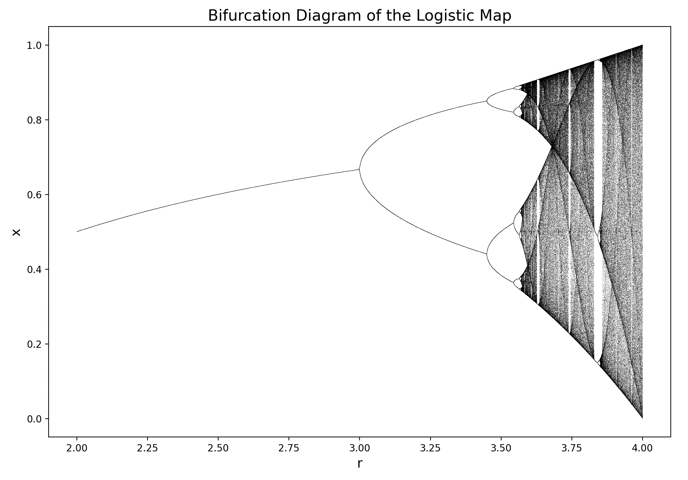
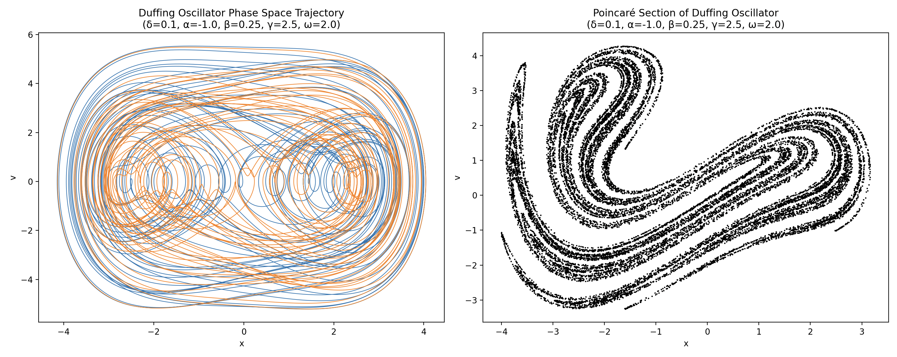

# Chaos Theory Simulations

## Overview

This project contains simulations written on Python of various phenomena that exhibit chaotic behavior. Namely, this includes simulating the Lorenz attractor, the bifurcation diagram of the logistic map, and the phase space and Poincaré sections of the Duffing oscillator. Details for each program is given below.

## Details

### Lorenz Attractor

`lorenz_attractor.py` simulates the trajectory of two particles with very similar initial conditions under the influence of the Lorenz system. The program calculates the trajectory of each particle by solving the system of ODEs using scipy.integrate's odeint function

A sample run of the program is shown below:

We see that while at first, each particle follows nearly identical paths, after a while they soon divergence to completely different trajectories, manifesting the chaotic nature of the system.

### Logistic Map

`logistic_map.py` calculates the evolution of a variable x under the process of the logistic map for different values of a parameter r and plots the corresponding bifurcation diagram. The program works by first letting x evolve for N steps where N is sufficently large so that we can skip the transient phase and reach a steady state. We then further let x evolve for another n step but this time while recording its value which are then plotted against r to create the bifurcation diagram.

The resulting bifurcation diagram is shown below:

We see that at first, x stays at a constant value for a given r, but at around r = 3 the branch splits into two, allowing x to jump between two different values. This phenomena, known as period-doubling bifurcation, repeats itself another few more times as seen in the diagram. However, at around r = 3.57 the system suddenly exhibits completely chaotic behavior, making x jump between unpredictable values. Interestingly enough however, even after r = 3.57 there are occasional windows (for example between r = 3.83 and 3.85) in which order suddenly returns and the system exhibits periodic behavior again.

### Duffing Oscillator

`duffing_oscillator.py` simulates the trajectory in phase space of a particle under the influence of the Duffing oscillator as well as its Poincaré section. The Duffing oscillator equation is essentially the same as the standard driven damped oscillator ODE but with an extra cubic term in x. The ODE is solved using scipy.integrate.odeint and the solution is plotted using matplotlib. This process is done separately for the phase space trajectory and Poincaré section since the latter requires a specific sampling rate and significantly longer simulation time. As with the Lorenz attractor, for the phase space trajectory, we let two particles with only slightly different initial conditions to evolve under the ODE and plot them together to see how much their trajectories differ.

The result of `duffing_oscillator.py` is shown below:

On the left, we see the phase space trajectories of the two particles and how they completely differ despite having very similar initial conditions. On the other hand, we have the Poincaré section of the first particle (in blue on the phase diagram) on the right plot. It is quite interesting to see that just by sampling from the phase space trajectory at the driving force frequency, we get this mysterious shape that looks as if it has been warped and folded onto itself many times. Indeed, strangely enough, it turns out that in theory, the Poincaré section would actually be a fractal after an infinite number of sampling from the phase space trajectory.
