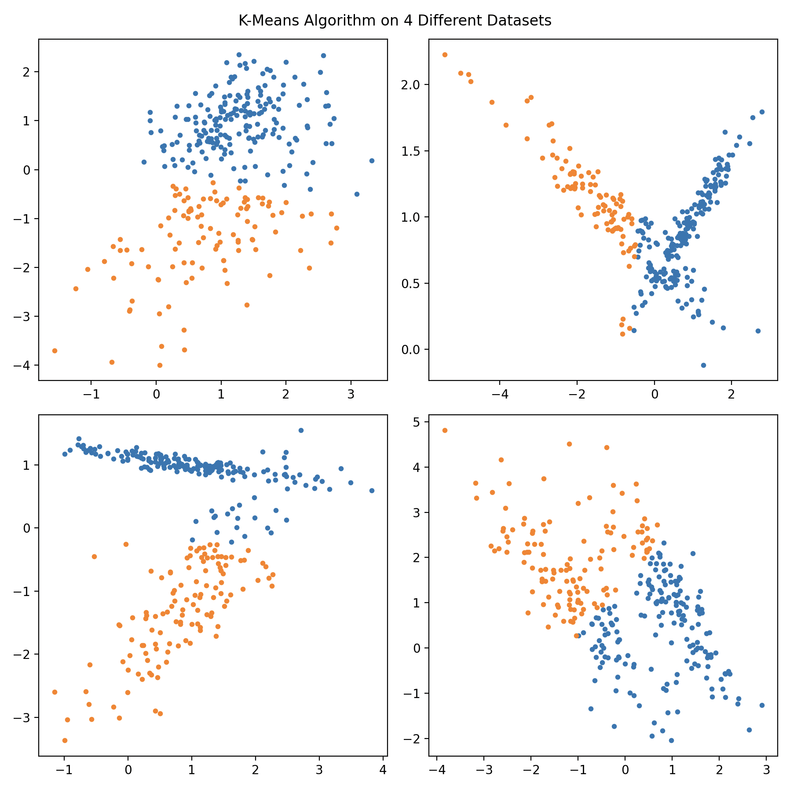
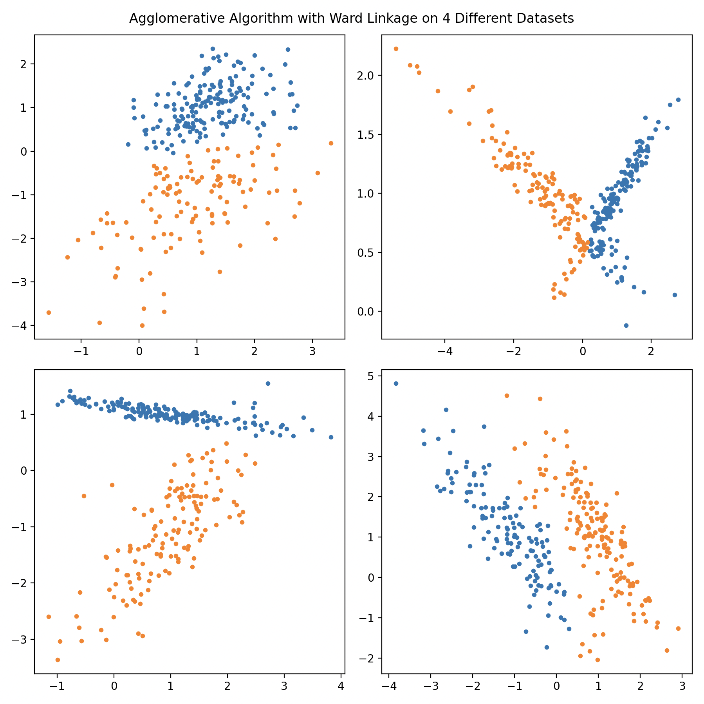
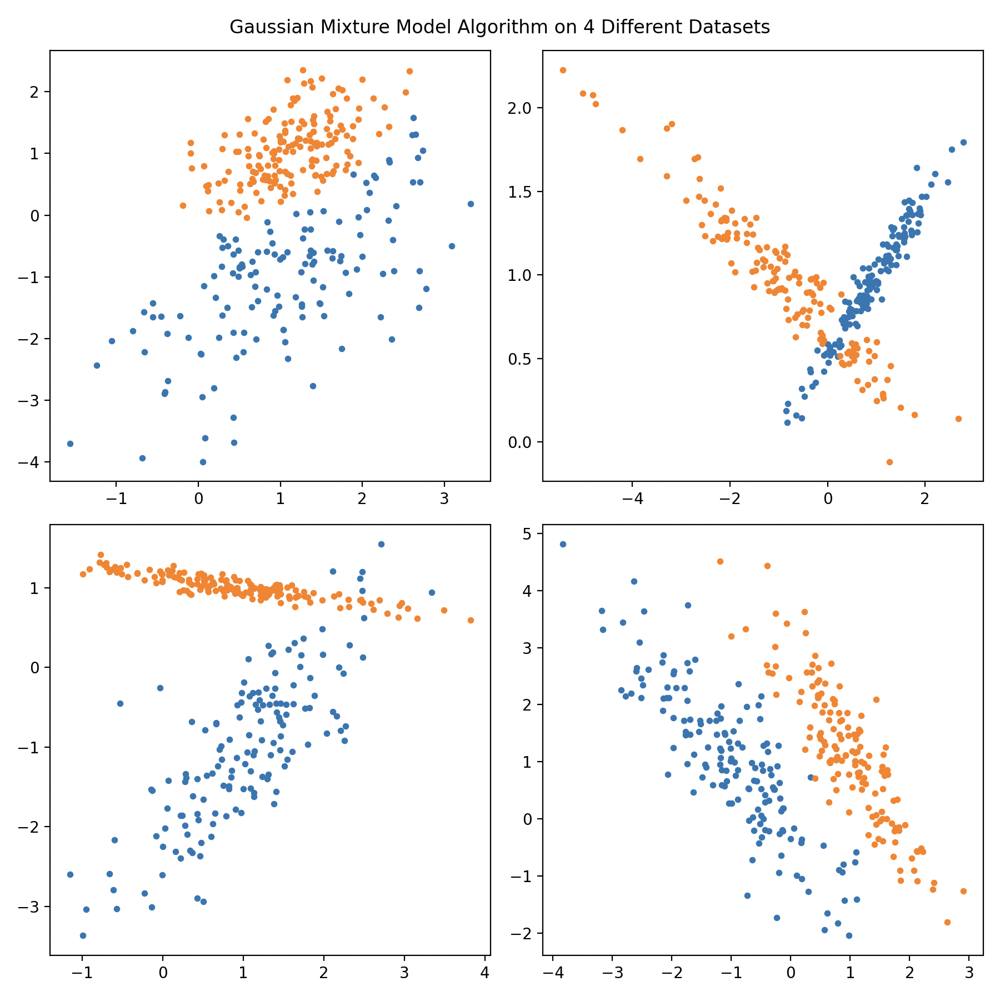
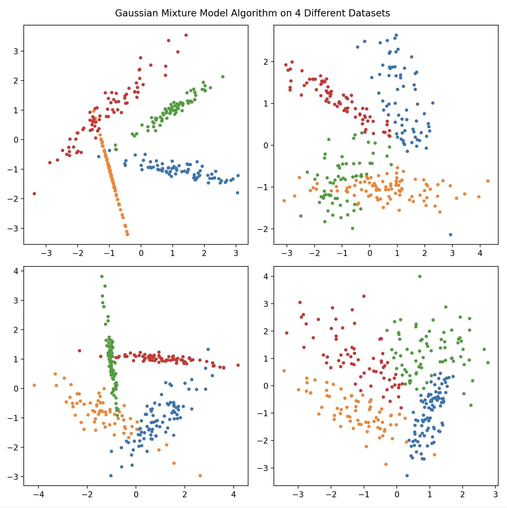

# Clustering Algorithms

## Overview
This project contains Python implementations of three fundamental data clustering algorithms, namely K-means clustering, agglomerative clustering, and Gaussian mixture models. Although libraries such as scikit-learn already have classes for these different algorithms, to understand their inner working and practice code optimization, I have decided to implement them from scratch. Details for each program are given below:

## Details

### K-Means Clustering
The first clustering algorithm we implement is the k-means clustering algorithm. The basic idea behind the algorithm is to first intialize k mean points called centroids, each corresponding to different clusters we wish to classify our data into. From here, the algorithm repeats the following steps until convergence is reached: (i) compute the distance of each data point from each centroid, (ii) label each data point to the centroid that it is closest to, (iii) each group of labelled points now becomes the new clusters and replace the centroids with the mean of each group. `kmeans.py` implements this algorithm and the algorithm is ran on four different datasets.

A sample run of the program is shown below:

Overall, we see that the algorithm has some sort of capability to distinguish between the two clusters but certainly returns crude results for some datasets. Perhaps the biggest drawback of the k-means algorithm is that it only selects points corresponding to a specific centroid in a circular radius, making it difficult when the clusters are more elongated like in the bottom right dataset.

### Agglomerative Clustering
The next clustering algorithm is a type of hierarchical clustering known as agglomerative clustering. The idea behind this algorithm is to first let all points be its own cluster and then slow merge the closest clusters until we reach the desired number of clusters. How we define this "cluster distance" is quite important and is known at the linkage method. The best linkage method often depends on the type of data we are dealing with, but in `agglomerative.py` we use the ward linkage method. Since this method requires us to calculate all possible distances between the many clusters and compare them, optimizing the code is vital and was what I found particularly difficult to address. However, I found that there is something known as a heap queue which is essentially a list that always has the smallest element at its root which is very useful in our scenario since it is the only element we care about. By storing the distances and corresponding clusters in this heap queue, I was able to drastically shorten the computation time.

We see that this time we get significantly better results than with the k-means algorithm, being able to almost perfectly distinguish between the two elongated clusters in the bottom right dataset that the k-means algorithm couldn't. However, the one issue that still persists is that the algorithm really struggles when the clusters begin overlapping such as in the top right dataset. 

### Gaussian Mixture Model
The third clustering algorithm is one that makes use of mixture models and since our data is inherently Gausisan, we are using Gaussian mixture models (GMM). The overall method of the GMM method is actually quite similar to the k-means algorithm in that we try to find an optimal center point and choose points close to the center to be in the cluster. The key difference is that by assuming that the data is in the form of a Gaussian distribution, the GMM model now tries to optimize a mean, covariance matrix, and weights for each cluster and takes a more probabilistic approach in this process. The advantages of this method is clear because by assuming that the data will be inherently mixtures of Gaussian distributions, we are able to address the issues that the previous two methods had. `gmm.py` implements this method and also calculates the log likelihood function at each iteration to determine whether the parameters have converged or not.

A sample run of the program is shown below:

We see that we now get almost perfect results for all the different datasets, being able to maintain the correct overall structure for each cluster even if they overlap. Although it is true that all the points in the overlap region seem to always be dominated by one of the clusters, this is quite understandable because once the clusters overlap, there is really no way of telling which points would correspond to which cluster. We can also test how the method would perform on a larger number of clusters as shown below:

Unsurprisingly, even with 4 clusters and heavy overlapping, the program still performs very well.
