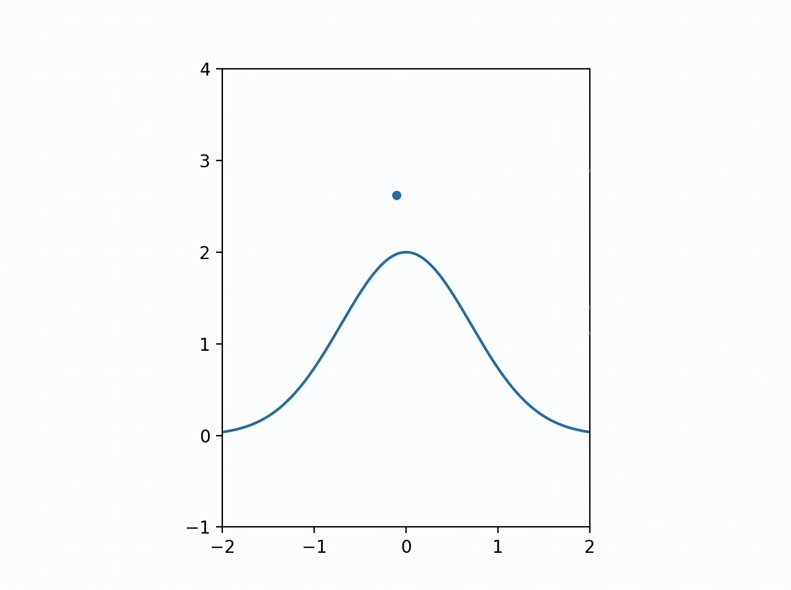
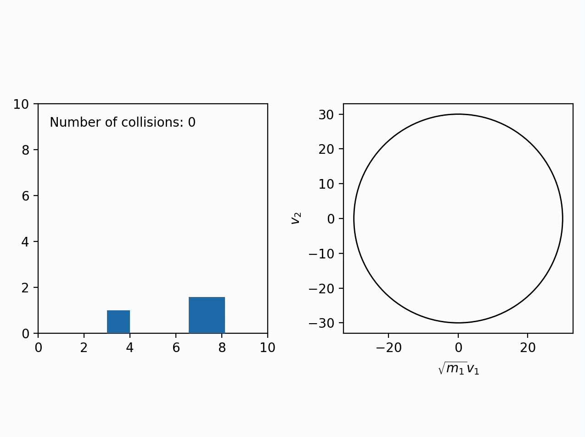

# Collision Simulations

## Overview

In this project, I have created several programs that simulate various scenarios involving collisions of particles. Each program will be individually discussed in detail below. 

## Details

### ball_curve_collision

`ball_curve_collision.py` is a basic program that can simulate a ball bouncing on an arbitrary curve that the user can input. The program works by constantly checking whether the ball has collidied with the curve or walls by calculating the distance between them and the ball's position. If a collision has occured, the velocity is changed accordingly. For collisions with the walls this is quite simple as it just involves reversing either the x or y component of the velocity, but for collisions with the curve, the velocity had to be reversed about the normal to the surface. This was done by calculating the deriavtive of the curve at that point and using that to create a normal vector. 

A sample run of `ball_curve_collision.py` is shown below:

### gas_simulation

`gas_simulation.py` simulates the collision between a large number of particles to mimic the way in the which particles in a gas behaves and is inspired by a similar program made by Mr. P Solver. The program mainly works by making use of the combinations function from itertools to keep track of every pair of particles and their corresponding separation to detect whether a collision has occured. In addition to this, the velocities are plotted on a histogram to compare it with the theoretically predicted Maxwell-Boltzmann distribution. You can see that as you let the simulation run for a bit, the distribution of velocities closely converges to the Maxwell-Boltzmann distribution.

A sample run of `gas_simulation.py` is shown below:

One issue with this program however, is that since we are dealng with a very large nummber of particles, it is very computationally expensive and can take forever to run if we try to increase the number of particles even more. To get around this, we can harness the power of GPUs (as opposed to CPUs) using CUDA which can significantly increase computing speed. `cuda_gas_simulation.ipynb` demonstrates this by recreating `gas_simulation.py` using PyTorch which allows us to use CUDA. With this new GPU-accelerated version, we are able to simulate even 5000 particles with ease, with it only taking 3 seconds to run the `calculate_motion` function. For comparison, the CPU version takes over 5 seconds to calculate the motion for only 300 particles for the same number of frames. Unfortunately the Jupyter Notebook file is too large though so it will not be displayed by GitHub and will need to be downloaded.

A sample run of `cuda_gas_simulation.ipynb` is shown below:

### pi_collision

`pi_collision.py` is inspired from a video by 3blue1brown called "Why do colliding blocks compute pi?". The simulation involves a block with mass of 100 kg to the power of an integer colliding with a stationary block of mass 1 kg. There is also a wall behind the 1 kg block which the block collides with. The interesting thing is that after all the collisions are done, the total number of collisions that occured exactly equal the first few digits of pi. The reason for this becomes apparent when we plot velocity of the smaller mass against the velocity of the larger mass (scalled by the square root of the mass) as done in the program. The laws of conservation of momentum and energy result in the system being constrained to a circle in this specific configuration space, from which the emergence of pi becomes clear if we consider how the number of collisions that must occur to fill out the whole circle. While the specific details of the physics is covered in the video by 3blue1brown I thought it would be interesting to verify this result by simulating it on Python as I have doen here.

A sample run of `pi_collision.py` is shown below:

