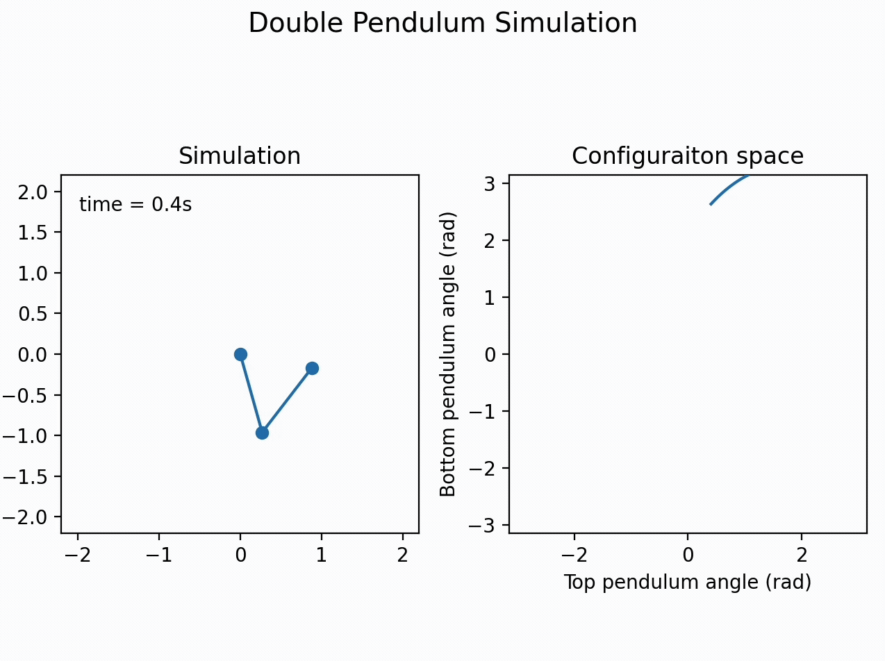

# Double Pendulum Simulation

## Overview

In this project, I have created a basic program that visually simulates the motion of a double pendulum while simultaneously tracing the path taken in its configuration space, $\phi_1$ vs $\phi_2$. While I originally wrote this program using vPython, I have also written a similar version using matplotlib to learn how to create animations with matplotlib. Both versions are included.

## Details

This program works by using the Runge-Kutta method (rk4) to solve the differential equations of the double pendulum. These differential equations can either be looked up online or derived using methods such as Lagrangian mechanics.

With the trajectory in physical space and configuration space calcualted, these can then be plotted using vPython or matplotlib. 

A sample run of the matplotlib version is shown below:
