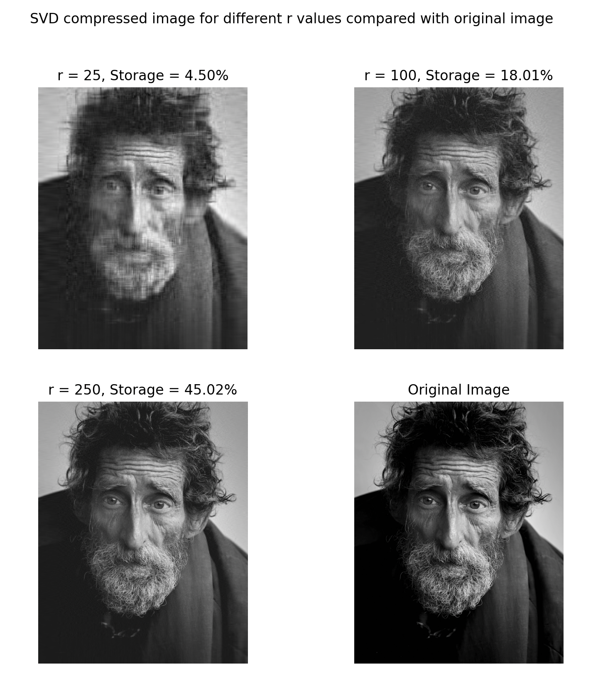
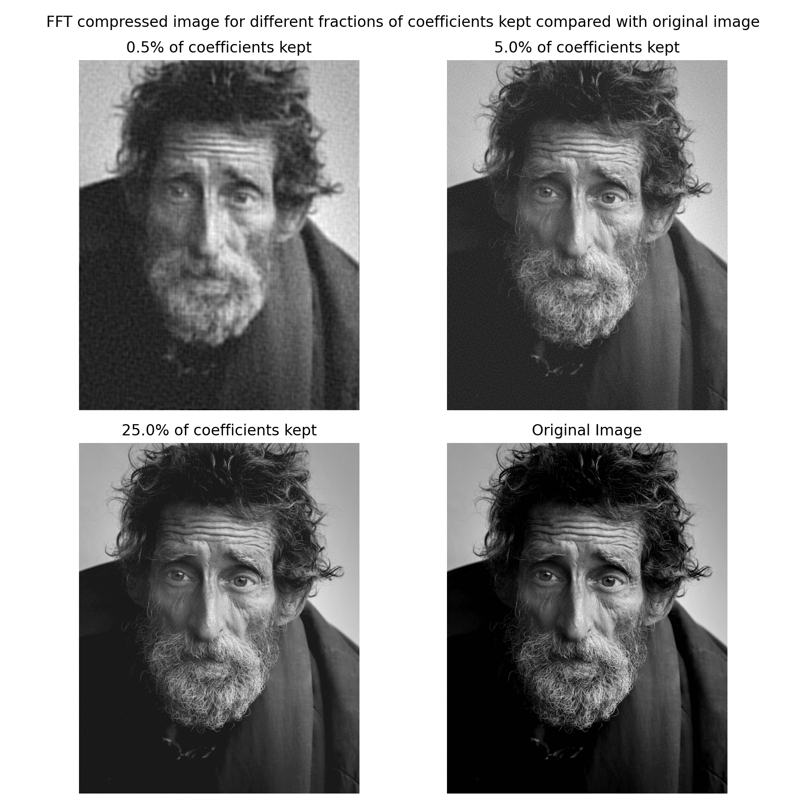
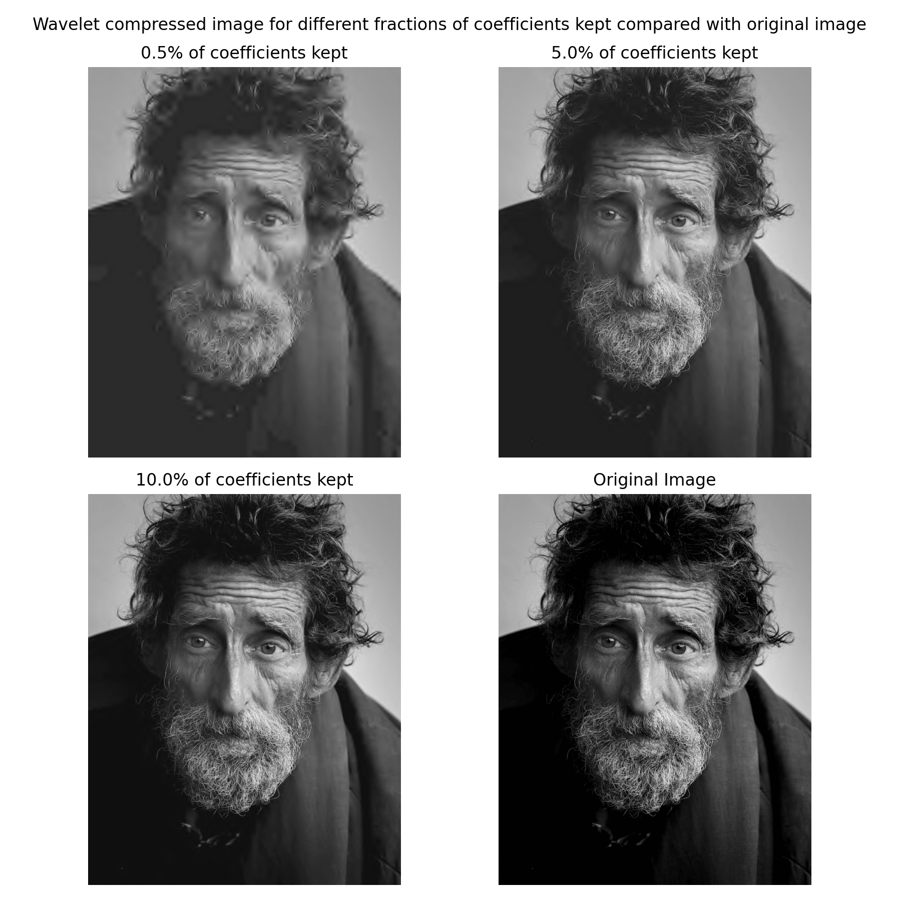

# Image Compression

## Overview
This project contains implementations of several different lossy image compression methods on Python and qualitatively comparing each method by having them compress the same image. Namely, the methods used are singular value decomposition (SVD), the Fourier transform, and the wavelet transform. Details and sample runs for each program are given below.

## Details

### Singular Value Decomposition
The first method of image compression in this project is using singular value decomposition. The idea behind this method is that by decomposing our image array into its singular values, we can compress the data into a lower dimensionality by discarding the more insignificant singular values. `svd_image_compression.py` implements this idea by making use of NumPy's built-in `linalg.svd` function to extract the three SVD matrices. We can then choose a specific truncation value, r, until which we want to discard the singular values for, and then recreate an approximaiton for the image with the truncated SVD matrices. A sample run of the program is shown below:

We can see that even with just 18% of the original data's storage, most of the important features of the image is recovered, with it only lacking a bit of detail. However, we can do much better with other methods as discussed below.

### Fourier Transform
The next method for image compression we will be going over is using the Fourier transform. The Fourier transform is a method that widely used in practice, with the industry standard compression method known as JPEG using the Discrete Cosine Transform (DCT). `fft_image_compression.py` implements this by performing a 2D FFT on the image array, only keeping the elements with the highest magnitudes, and finally transforming back using the 2D inverse FFT. A sample run of the program is shown below:

It is evident that this compression method is significantly better than the SVD method, and we can reproduce the original image with very high resolution using only 25% of the coefficients. 

### Wavelet Transform
The wavelet transform is a very similar method as the Fourier transform but instead relies on wavelets which are localized in both space and frequency, allowing us to decompose the image into greater detail that the Fourier transform could not achieve. What makes the wavelet transform even more powerful is that it can be multi-leveled, meaning that we can recursively apply the transform to break down the image into multiple detail levels. We can then do as we did before, and keep only the most significant coefficients and transform back. `wavelet_image_compression.py` implements this idea using the PyWavelets library and allows the user to manually choose a specific wavelet and level. The default bior4.4 wavelet that is chosen in the program is equivalent to the CDF 9/7 wavelet that is used in the irreversible version of the JPEG 2000 compression method. A sample run of the program is shown below:

We see that this method does an even better job than the Fourier transform, with it having very high resolution at only 10% of coefficients. However, it should be noted that this method isn't as widely used since the DCT based JPEG method is more simple to implement, and does a good enough job for everyday use.
