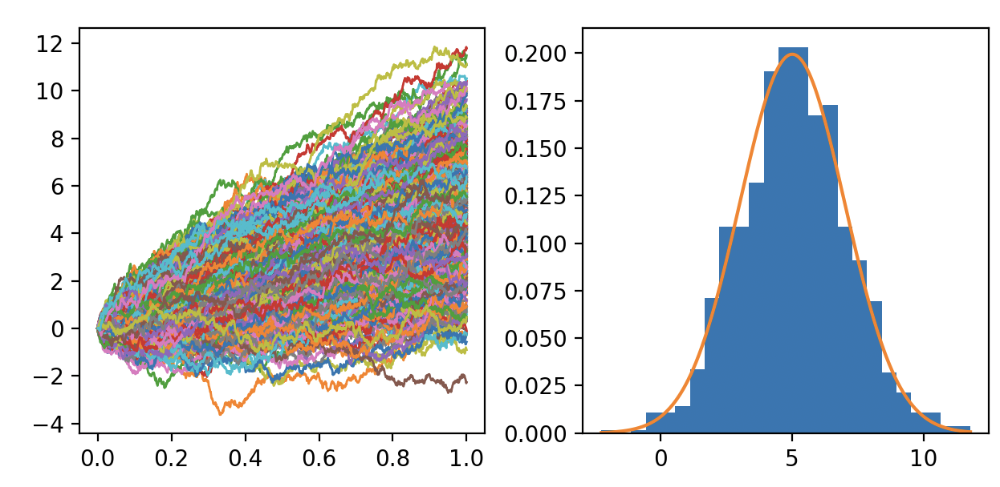
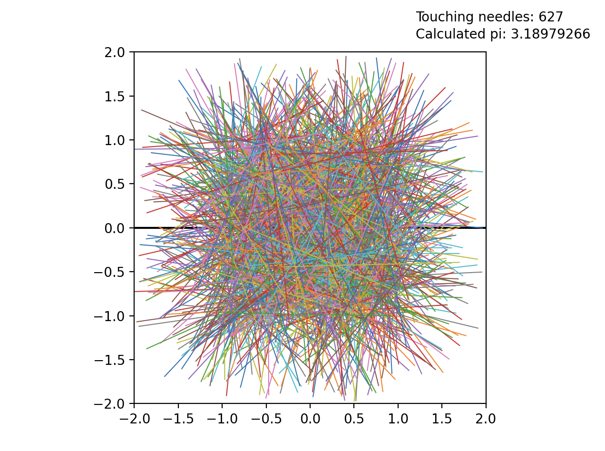

# Monte Carlo Simulations

## Overview

This project contains several programs that feature Monte Carlo methods, where repeated random sampling is used to either compute approximate values or simulate random processes. The details for each program is discussed below.

## Details 

### Brownian Motion

This program simulates the stochastic process known as Brownian motion, where the value of a function constantly undergoes random fluctuations. One important application of this is in the context of stock prices since they are precisely an example of something that undergoes Brownian motion. In particular, the program simulation basic Brownian motion with drift. The program works by calculating the small change the path takes after each step using a random normal distribution and cumulating each of these changes to determine the whole path. This is done simultaneously for multiple paths and each are plotted on a graph. Furthermore, the program also plots all the final values of each path on a histogram and compares that to the theoretical distribution expected. For large n, we see that the histogram approaches the correct distribution.

A sample run is for a mean of 5 and standard deviation of 2 is shown below:

### Buffon's Needle

While the most popular method to compute pi using random sapmpling is to project random points onto a circle, a slightly less known method is the one featured here known as Buffon's needle. To understand how this works, imagine we had a floor with evenly spaced lines and we randomly dropped a large number of needles onto it. It turns out that an approximate value for pi can be calculated just by counting the number of needles that touch a line. Although I will not go further into the theory, feel free to do some reserach to find out why this is the case. In order to simulate this, I randomly sampled positions and angles for n needles and for simplicity sake, assumed there was only one line at y = 0. Then, by checking whether y = 0 lied between the two end points of each needle, the program determines whether each needle touches the line or not and using that, calculates a value for pi. I have also implemented a simple plot on matplotlib to show the scenario. Although the precision is admittedly not great, I still find it an interesting way to compute pi.

An example run with 1000 needles is shown below:

### n Dimensional Sphere

This program is an example of Monte Carlo integration, another important application of the Monte Carlo methods. In this case, the integral we are calculataing is the n-dimensional integral of 1 on the n-dimensional unit sphere (i.e. we are calculating the volume). The program works by randomly choosing a large number of points in an n-dimensional box, and determining which one of them fall inside the sphere by checking if its norm is less than 1. Finally, by multiplying the volume of the box times the points inside divided by the total points, we get an approximate value for the volume of the sphere. Furthermore, the program also calculates the theoretical value for the volume for comparison. 