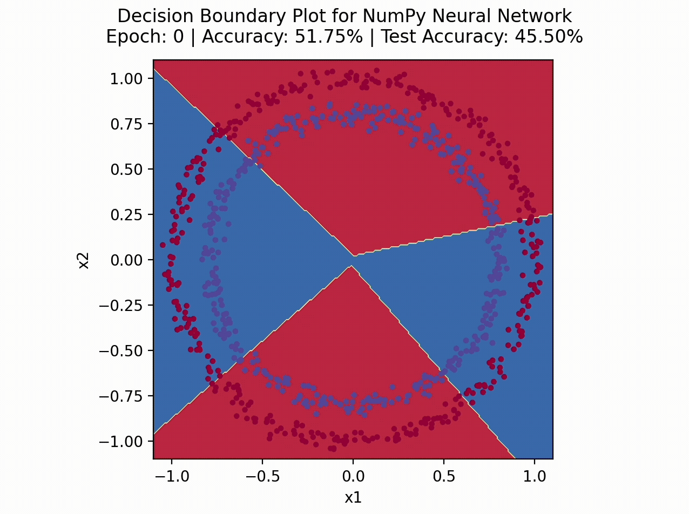

# Making a Neural Network from Scratch

## Overview

A common beginner machine learning challenge I often see is making a neural network from scratch without using any machine learning frameworks such as TensorFlow or PyTorch. Being a very instructive challenge, I thought I would attempt it myself as well by trying to create a neural network that can solve a basic binary classifcation problem using only NumPy. The specific dataset I will be using is the circles dataset from scikit-learn. Although I could have attempted a computer vision problem instead using the popular MNIST dataset, I thought this would be nicer to visualize since we can plot the decision boundaries of our model as it learns. The details of the program are given below.

## Details

The neural network created in `numpy_neural_network.py` has the basic structure of 2 input units -> 16 hidden units -> ReLU activation function -> 2 output units -> sigmoid activation function. The intermediate ReLU function is of course neccessary since the data in inherintly non-linear so a purely linear neural network would not work. The ReLU and sigmoid functions are defined manually and using them we can also define the forward pass function, `forward_pass`, given certain weights and biases. To get the model to learn, we now need to choose a specific loss function and create a function that can peform backpropagation and gradient descent. For our loss function, I have chosen the binary cross entropy function as it is the standard function to use for binary classification problems like this. Given this loss function, we can now define the `backpropagation` function that calculates the correpsonding derivatives and updates the weights and biases through gradient descent. When deriving the formulas for these derivatives, I interestingly found that the derivative of the loss function with respect to the pre-activated output neurons is in a remarkably simple form, possibly suggesting that the binary cross entropy function was designed such that this derivative would be simple if paried with the sigmoid function. In addition to these functions, we also define the `initialize_parameters` function that intializes random weights and zero biases to our model, as well as the `plot_decision_boundary` function that plots the current decision boundary of our neural network. With these necessary functions, the model can now be trained using the `train` function. Although not really necessary for such a simple dataset, I have also split the data into a train set and test set to follow standard machine learning practices and confirm that our model is not just overfitting on the train data.

A sample run of the program's decision boundary plotting is shown below:

