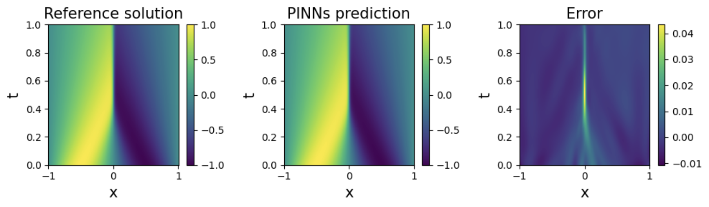

# Solving PDEs with a Physics Informed Neural Network

## Overview

This project is highly inspired by a tutorial on PINNs I found on github by nguyenkhoa0209 and I have primarily followed their tutorial and implemented it myself using PyTorch. The idea behind this program is to solve the Burgers' equation (a nonlinear PDE) using a Physics Informed Neural Network (PINN). What makes a PINN different from a standard neural network is that we bake in the rules of physics into the loss function so that the neural network always tries to follow the given rules. In this case, the rules would be the PDE itself, the initial conditions, and the boundary conditions. Details of the program are given below.

## Details
The actual neural network used here is actually a very simple one with tanh as our activation function. As explained above, what makes it special is our choice of loss function which involves a PDE part, an initial condition part, and a boundary condition part, where each part is calculated by summing the difference squares from our required values. In doing so, since the neural networks tries to minimize this loss function, we are able to produce a relatievly high accuracy solution to the PDE. To verify our solution, we can compare it to a reference solution calculated using traditional methods given in `burgers_solution.npy`. This solution was computed by modifying the `burgers.py` code from my Burgers Equation Simulation project. A sample run of the program and its final plots is shown below:

We see that the solution from the PINN matches the reference solution with minimal error. If we would like to minimize this error as much as possible, we could adjust the network strucutre, the number of hidden units, its learning rate, etc. (Note that the reference solution also is not 100% accurate).
