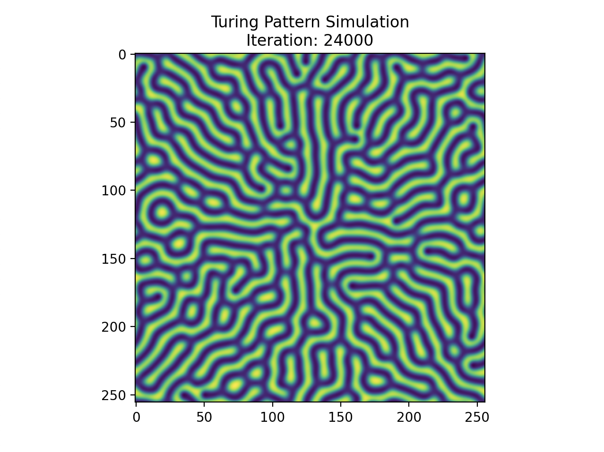

# Turing Pattern Simulation

## Overview
This program simulates Turing patterns, a pattern often found in nature on many animals such as zebras, fish, seashells, and many more. The basic principle that governs the formation of these patterns is described by the reaction-diffusion model, where multiple substances diffuse in space while also reacting with each other until a stable state is reached. If each substance corresponds to a distinct pigment, then a visual pattern arises. This process can be described by a set of partial differential equations and in this program we use the Gray-Scott equations. A detailed explanation of the program is given below.

## Details
The program works by using a finite difference approximation to repeatedly solve the system of PDEs on an NxN grid composed of two substances, u and v. The initial conditions of the system is given by first letting u = 1 and v = 0 for all points in the grid but with a square in the center with u = 0.5 and v = 0.25 such that reaction occurs at the center. However, since we don't want a perfectly symmetric pattern, this square is further pertubed by random noise.

An example of the pattern produced from the program is shown below. The specific pattern generated by this prorgam closely resembles that of an mbu pufferfish.

